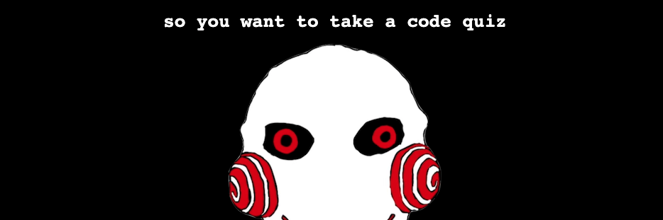

# Do you want to take a code quiz?

## The most horrifying quiz on the net!

[Live Demo](https://sissyhanks.github.io/do-you-want-to-take-a-code-quiz/)

When I was tasked with this project i knew right away that I would name the repo Do You Want to Take a Quiz. I had visions of the antagonist from Saw chasing the user through the questions, waiting to steal the precious resource of their time if they gave an incorrect answer. I was excited to use javascript to make the effects I envisioned come alive on the screen, and I knew that without the world of a working quiz those effects would fall flat. I had my daughter draw my villein, and with an errant key stroke while saving the image file jugsaw, the javascript gremlin, was born.

If only I had realized the terror that had been unleashed.

While writing the script for the quiz itself I learned the dangers of not unifying the data type of values you want to compare and that typing things out will probably save a lot of time over copying similar statements from one section of script to use in another.

After a lot of trial, error, research, and hashing it out with advisors and peers, I had a program that successfully took the user through a timed quiz. Scores were increased and tracked on correct answers, time penalizations enforced for incorrect answers, and final tallies, along with the user's self identification saved in local memory and displayed after each run through the quiz.

It was time to add my horror story to the quiz, and horror story did it become.

I was amazed at how quickly I was able to create append and set the attributes of document elements after all of the practice I had doing so in the display of information withing the quiz. I continually checked the functionality of the quiz while updating the effects and at one point ran into a break in the code. i consol logged my way through the problem, found a missing curly bracket and was back in business. Soon it seemed I was finished with function and simply needed to update the content to effectively tell the story.

My concept was that developers would be lured in by a personality quiz where the errors generated by the javascript they write would tell them about their true self, only to find out that jugsaw had taken over their computer to put them to a javascript test that would rob them of their precious time. And when I pushed my project to github I learned that the developer who jugsaw was plaguing was ME!

I found that at some point my scores stopped saving to local memory, but because i had a bunch of information already locally stored my program seemed to work. I tried for a bit to locate the source of the disconnect, but coding in jugsaw had eaten up the last of my time. I had to update my content to fit what the story of my quiz had become and turn it in.

During the final review of my code i discovered that the syntax i had used to style elements was different in different sections of my script. That might have lead to problems with how my script was read, or i may have altered something that i couldn't identify while referencing something in the script. Getting jugsawed at the end of this project taught me to clear local memory often when testing during devolvement.

And now to find out what else jugsaw has to teach me.

## Credits

Referencing [Jamie Morris' Code Quiz repo](https://github.com/jamierachael/Code-Quiz) helped me wrap my head around working on a project with multiple javascript & HTML files.

Thank you to Mena McKnight for providing the illustrations for this project.
